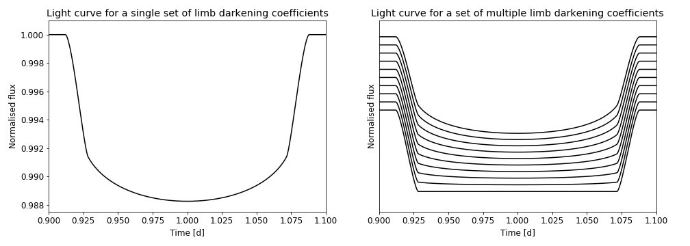

PyTransit
=========

Fast and easy-to-use tools for exoplanet transit light curve modelling using Python or Fortran.

    from pytransit.gimenez import Gimenez
    
    m = Gimenez()
    f = m.evaluate(t, *pv)

Modules
-------
Transit models
  - Optimized and parallelized Fortran implementation of the transit model by A. Gimenez (A&A 450, 1231--1237, 2006).
    - Can calculate the transit model simultaneously for several limb darkening coefficient sets.
    - Built-in supersampling.

Utilities
  - Routines to calculate the projected planet-to-star distance for circular and eccentric orbits.
  - Routines to calculate transit durations, etc.

Installation
------------
Building and installing is simple using a fairly modern gfortran, use --user for a local installation without root rights.

    python setup.py config_fc --fcompiler=gnu95 --opt="-Ofast -ffast-math" --f90flags="-cpp -fopenmp -march=native" build
    python setup.py install [--user]
    
The code should compile with other compilers also, but only gfortran and Intel fortran have been tested.

Examples
--------
### Basics
Basic usage is simple:

    from pytransit.gimenez import Gimenez
    
    m = Gimenez()
    f = m.evaluate(t, *pv)

Here we first initialize the model accepting the defaults (quadratic limb darkening law, no supersampling, 
and the use of all available cores), and then calculate the model for times in the time array `t`, `pv` being 
a list containing the system parameters.

For a slightly more useful example, we can do:

    import numpy as np
    from pytransit.gimenez import Gimenez
    
    t = np.linspace(0.8,1.2,500)
    k, t0, p, a, i, e, w = 0.1, 1.01, 4, 8, 0.48*np.pi, 0.2, 0.5*np.pi
    u = [0.25,0.10]

    m = Gimenez()
    f = m.evaluate(t, k, u, t0, p, a, i, e, w)

where `k` is the planet-star radius ratio, `t0` the transit center, `p` the orbital period, `a` the scaled
semi-major axis, `i` the orbital inclination, `e` the orbital eccentricity, `w` the argument of periastron,
and `u` contains the quadratic limb darkening coefficients.

### Multiple limb darkening coefficient sets

The model can also be evaluated for several limb darkening coefficient (ldc) sets simultaneously (much faster than
evaluating the model several times for different coefficient sets):

    ...
    u = [[0.25, 0.1],[0.35,0.2],[0.45,0.3],[0.55,0.4]]

    m = Gimenez()
    f = m.evaluate(t, k, u, t0, p, a, i, e, w)
    
In this case, the model returns several light curve models, each corresponding to a single ldc set.

### Supersampling
The transit model offers built-in *supersampling* for transit fitting to transit photometry with poor time 
sampling (such as *Kepler*'s long cadence data):

    m = Gimenez(supersampling=8, exptime=0.02)
    ...

### Tweaking
The model accuracy and the number of limb darkening coefficients can be set in the initialization. 
Finally, for fitting to large datasets, the model can be evaluated using interpolation (linear, at the moment). 

Basic transit model usage with linear limb darkening law, lower accuracy, and four cores:

    m = Gimenez(npol=50, nldc=1, nthr=4)
    ...
      
Transit model using linear interpolation:

    m = Gimenez(lerp=True)
    ...

### Advanced

Calculate projected distance for a circular or eccentric orbit given time t, transit center time t0, period p, 
scaled semi-major axis a, inclination i, eccentricity e, and argument of periastron w:

    import numpy as np
    from pytransit.orbits_f import orbits as of

    t0, p, a, i, e, w = 1.01, 4, 8, 0.48*np.pi, 0.2, 0.5*np.pi

    t   = np.linspace(0.8,1.2,500)
    zc  = of.z_circular( t, t0, p, a, i, nthreads=0)                  
    zen = of.z_eccentric_newton(t, t0, p, a, i, e, w, nthreads=0) # Calculated using Newton's method
    ze3 = of.z_eccentric_s3(t, t0, p, a, i, e, w, nthreads=0)     # Calculated using series expansion (ok for e<0.15)
    ze5 = of.z_eccentric_s(t, t0, p, a, i, e, w, nthreads=0)      # Calculated using series expansion (ok for e<0.25)
    zel = of.z_eccentric_ip(t, t0, p, a, i, e, w, nthreads=0, update=False) # Faster for large LCs, uses linear interpolation

Transit model using linear interpolation, two different sets of z:

    m  = Gimenez(lerp=True)      # Initialize the model
    I1 = m(z1,k,u)               # Evaluate the model for z1, update the interpolation table
    I2 = m(z2,k,u, update=False) # Evaluate the model for z2, don't update the interpolation table
    
Author
------
  - Hannu Parviainen <hpparvi@gmail.com>, University of Oxford

Publications using the code
----------------------------
  - Gandolfi, Davide, H. Parviainen, et al. Kepler-77b: a very low albedo, Saturn-mass transiting planet around a metal-rich solar-like star. Astron. Astrophys. 557, A74 (2013).
  - Parviainen, Hannu, H.J. Deeg, and J.A. Belmonte. “Secondary Eclipses in the CoRoT Light Curves: A Homogeneous Search Based in Bayesian Model Selection.” Accepted to A&A (2012)
  - Rouan, D., H. Parviainen, C. Moutou, Magali Deleuil, M. Fridlund, A Ofir, M. Havel, et al. “Transiting Exoplanets from the CoRoT Space Mission.” Astronomy & Astrophysics 537 (January 9, 2012): A54.
  - Murgas, F., E. Pallé, A. Cabrera-Lavers, K. D. Colón, E. L. Martín, and H. Parviainen. “Narrow Band H α Photometry of the super-Earth GJ 1214b with GTC/OSIRIS Tunable Filters.” Astronomy & Astrophysics 544 (July 24, 2012): A41.
  - Tingley, Brandon, E. Palle, H. Parviainen, H. J. Deeg, M. R. Zapatero Osorio, A. Cabrera-Lavers, J. a. Belmonte, P. M. Rodriguez, F. Murgas, and I. Ribas. “Detection of Transit Timing Variations in Excess of One Hour in the Kepler Multi-planet Candidate System KOI 806 with the GTC.” Astronomy & Astrophysics 536 (December 12, 2011): L9.
